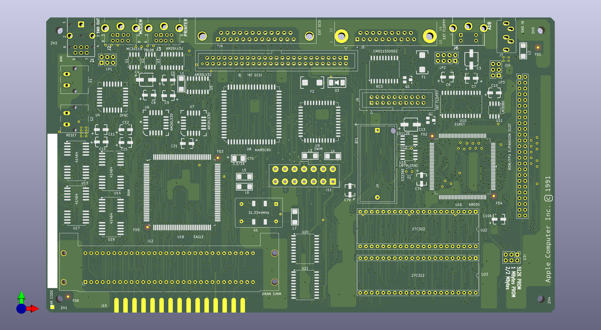

# ClassicII
Reproduction of Macintosh Classic II

This was reverse-engineered from a later-revision Classic II logic board. All components on the front side, and a handful of components on the back side, were removed, and the board was scanned.

Since my scanner isn't very accurate, scale-wise, the scans were resized and aligned to match the board's measurements.

The board was severely damaged by battery and capacitor leakage, but I was able to faithfully reproduce all connections.

The inner layers are used for various ground and power planes - you can make out a surprising amount of inner detail by backlighting the board and seeing what shines through the windows left by vias, etc., so these are also reproduced fairly accurately.

The [Bomarc schematics](documents/Bomarc%20schematics%20-%20corrected.pdf) for this board were useful as a reference, but they are for the earlier revision, and they do contain some inaccuracies.

## Issues

The layout of [my schematic](ClassicII.pdf) could use a little help, as I don't know enough about a lot of the signals on the undocumented Apple ASICs to classify them correctly.

The silkscreen markings of the PCB aren't as nice as I'd like yet.

There should be a "reloaded" version that will better serve those who need to replace their existing board. It should have footprints for both the older and the newer revision ROM chips. The footprints for the electrolytic caps should be widened to make them friendlier to replace with tantalums. The battery should accommodate a 2032 coin cell.
